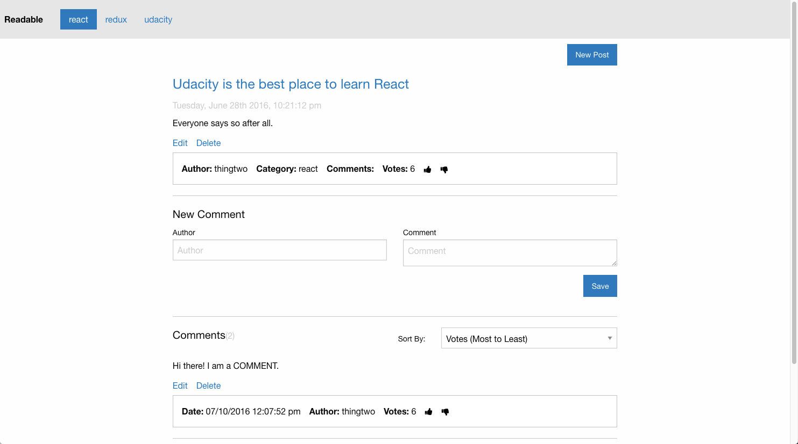

## Readable Project

This project is an app for making discussion posts. Users have the ability to vote on the best posts, comment on posts, and edit/delete posts. There is also the ability to vote on comments and edit/delete comments. Post are grouped by categories so the user can choose to filter the posts most important to them.

To install the app perform:
```npm install```

To run the app perform:
```npm start```

Here is a screenshot of the app:


